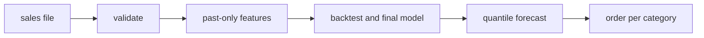
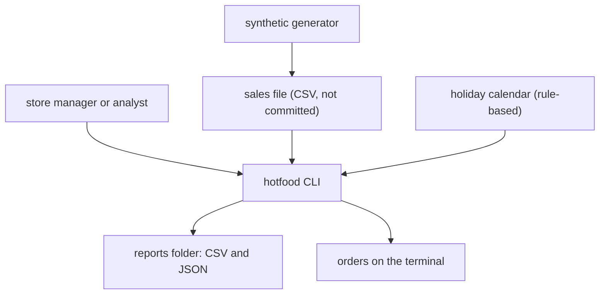
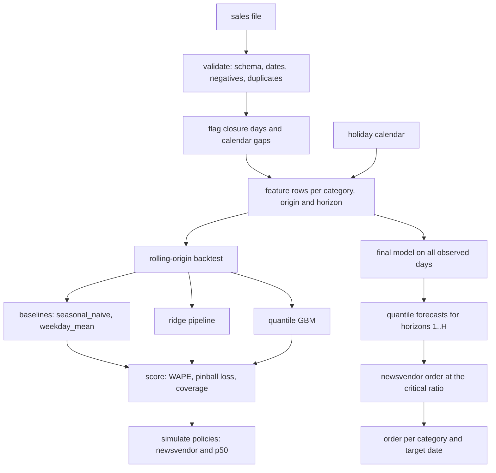

<div align="center">

# hotfood-forecast — Hot-Food Demand Forecast And Order Planner

**hotfood-forecast is a forecast and order tool for the hot-food counter of a convenience store. It takes a daily sales file through these steps to give an order per category and day:**

`validate` → `build past-only features` → `backtest models` → `forecast quantiles` → `order (newsvendor)`.


**[Summary](#1-summary)** ·
**[Workflow](#4-the-end-to-end-workflow)** ·
**[Run it](#10-how-to-run-hotfood-forecast)** ·
**[Configuration](#104-environment-variables)** ·
**[Known problems](#13-known-problems)** ·
**[Glossary](#15-glossary)**

</div>

> [!NOTE]
> This README uses ASD-STE100 Simplified Technical English. The writing rules and the project
> vocabulary are in [`docs/ste-style-guide.md`](docs/ste-style-guide.md). Each term in the
> [Glossary](#15-glossary) has only one meaning.

---

hotfood-forecast forecasts the daily demand of four hot-food categories and turns the forecast into an order. Each demand feature reads only days on or before the origin. A rolling-origin backtest compares every model with two baselines. Quantile forecasts go into a newsvendor rule that balances waste against stock-outs with the price and the unit cost of each category.

This README is the **one location that explains all of hotfood-forecast**. It gives these topics:

- the general design
- each component and its procedure, step by step
- the decision rules
- the data map
- the runbook
- the validation results and the known problems

| If you are… | Read |
|---|---|
| A manager or reviewer | [1](#1-summary), [3](#3-design-rules), [4](#4-the-end-to-end-workflow), [12](#12-validation-results), [14](#14-key-points) |
| A developer who joins the project | All sections, in sequence. Keep [10](#10-how-to-run-hotfood-forecast) and [13](#13-known-problems) open while you work |
| An operator who runs hotfood-forecast | [10](#10-how-to-run-hotfood-forecast), then [8](#8-the-order-decision) |

---

## Table of contents

1. 🧭 [Summary](#1-summary)
2. 🏗️ [How hotfood-forecast is built](#2-how-hotfood-forecast-is-built)
   - 2.1 [Components](#21-components)
   - 2.2 [System context](#22-system-context)
   - 2.3 [Repository layout](#23-repository-layout)
3. 🛡️ [Design rules](#3-design-rules)
4. 🔄 [The end-to-end workflow](#4-the-end-to-end-workflow)
   - 4.1 [Full flow](#41-full-flow)
   - 4.2 [The life cycle of one forecast](#42-the-life-cycle-of-one-forecast)
5. 🔵 [Data validation](#5-data-validation)
6. 🟢 [Past-only features](#6-past-only-features)
7. 🟣 [Models and the backtest](#7-models-and-the-backtest)
8. ⚖️ [The order decision](#8-the-order-decision)
9. 🗂️ [Data and file map](#9-data-and-file-map)
10. ▶️ [How to run hotfood-forecast](#10-how-to-run-hotfood-forecast)
    - 10.1 [Prerequisites](#101-prerequisites) · 10.2 [Installation](#102-installation) · 10.3 [Run hotfood-forecast](#103-run-hotfood-forecast) · 10.4 [Environment variables](#104-environment-variables)
11. 🧩 [How to extend hotfood-forecast](#11-how-to-extend-hotfood-forecast)
12. ✅ [Validation results](#12-validation-results)
13. ⚠️ [Known problems](#13-known-problems)
14. 📌 [Key points](#14-key-points)
15. 📖 [Glossary](#15-glossary)
16. 📄 [License](#16-license)

---

## 1. Summary

**The problem.** A hot-food counter cooks food for one day, and each unit that it does not sell is waste. The difficult questions are:

- How many units will each category sell on each of the next days?
- Is a forecast model better than "the same weekday last week"?
- How many units must the counter cook when a wasted unit and a lost sale have different costs?

hotfood-forecast gives each of these questions its own stage. The backtest scores every model on past origins with the same code that makes the final forecast.

| Item | Value |
|---|---|
| Input | A daily sales file: date, units of four categories, optional prices, holiday and closure flags |
| Output | Quantile forecasts (`q0.1` … `q0.9`) and an order per category and target date |
| Components | **6**: validation, features, models, backtest, newsvendor order, waste simulation |
| Providers | None. The holiday calendar is rule-based. No API key and no network |
| Offline mode | Everything. A synthetic data generator feeds the demo and the tests |
| Safety | Demand features read only days on or before the origin. A test changes all later days and checks that no feature changes |
| Tests | **58** unit tests pass (`pytest`), 1 optional test skips without LightGBM |



---

## 2. How hotfood-forecast is built

### 2.1 Components

| Component | Module | Purpose |
|---|---|---|
| Settings | `src/hotfood_forecast/config.py` | Environment variables and `.env`, with checks |
| Schema | `src/hotfood_forecast/schema.py` | Column names of the sales file and of the feature rows |
| Data validation | `src/hotfood_forecast/data.py` | Load, check and flag closure days and calendar gaps |
| Synthetic data | `src/hotfood_forecast/synthetic.py` | A known demand process in the store layout |
| Holiday calendar | `src/hotfood_forecast/calendar.py` | `us_federal` or `none`, for history and future dates |
| Features | `src/hotfood_forecast/features.py` | Direct multi-horizon feature rows, past-only demand features |
| Models | `src/hotfood_forecast/models.py` | Two baselines, a ridge pipeline, quantile GBM, optional LightGBM |
| Metrics | `src/hotfood_forecast/metrics.py` | MAE, RMSE, WAPE with interval, sMAPE, pinball loss, coverage |
| Backtest | `src/hotfood_forecast/backtest.py` | Rolling-origin test with a new model for each fold |
| Newsvendor | `src/hotfood_forecast/newsvendor.py` | Costs, critical ratio and order from quantile forecasts |
| Simulation | `src/hotfood_forecast/simulate.py` | Waste, stock-outs, fill rate and profit of a policy |
| Final forecast | `src/hotfood_forecast/forecast.py` | Final model on all observed days, forecast and orders |
| CLI | `src/hotfood_forecast/cli.py` | The `hotfood` command |

### 2.2 System context



### 2.3 Repository layout

```
hotfood-forecast/
├── .github/workflows/ci.yml   # pytest on Python 3.11
├── data/README.md             # data source, columns, how to get the data (no data files)
├── docs/ste-style-guide.md    # writing rules and project vocabulary
├── src/hotfood_forecast/      # the package (one module per component, see 2.1)
├── tests/                     # 59 offline tests on synthetic data (1 needs LightGBM)
├── .env.example               # variable names only
├── pyproject.toml             # dependencies, extras, the hotfood command
└── LICENSE                    # MIT
```

---

## 3. Design rules

### 3.1 Past-only demand features
A demand feature reads only units on or before the origin. A calendar feature and the price describe the target date, because the store knows them in advance. `features.py` builds each feature row from array positions that are not after the origin. The test `test_features_do_not_read_after_the_origin` changes all later units and checks that no feature changes.

### 3.2 A direct forecast, no recursion
Each horizon has its own feature row. The forecast never writes a prediction back into a feature. Thus the calendar features always describe the correct target date.

### 3.3 One aligned table for all metrics
`metrics.evaluate` takes one table that holds the actual units and the quantile forecasts in the same rows. The key is target date, category and horizon. `metrics.align` joins on that key and refuses duplicate or unmatched rows.

### 3.4 Closure days are flags, not data
A closure day and a calendar gap stay in the calendar as flags. They do not go into training targets, rolling means or metrics. No value is filled with a median or a zero.

### 3.5 A pipeline for all preprocessing, a new model for each fit
Each model keeps its preprocessing in a scikit-learn `Pipeline`. The backtest makes a new model for each fold and fits it on rows whose target date is not after the origin. The final forecast makes one more new model and fits it on all observed days.

### 3.6 Baselines first
The default `--models` list of the backtest includes `seasonal_naive` and `weekday_mean`. The CLI tells you if `--models` has no baseline. A model is useful only if it gives a lower WAPE and pinball loss than the baselines.

### 3.7 Orders come from costs, not from the median
The order is the demand quantile at the critical ratio of the category. The newsvendor module calculates this ratio from the price, the unit cost and the disposal cost.

---

## 4. The end-to-end workflow

### 4.1 Full flow



### 4.2 The life cycle of one forecast

1. Load the sales file and validate it.
2. Flag the closure days and the calendar gaps.
3. For each category, build the feature rows of all past origins and horizons.
4. Keep the rows whose target date is an observed day.
5. Fit a new final model on these rows.
6. Build one feature row for each horizon from the last date as the origin.
7. Forecast the quantiles for each row and sort them.
8. Interpolate the quantile at the critical ratio and round up to whole units.
9. Show the order for each category and target date.

---

## 5. Data validation

**Purpose.** Make sure that the sales file is complete and correct before a model uses it.

| Input | Output |
|---|---|
| CSV file in the store layout (`data/README.md`) | `SalesData`: units, prices, closure flags, gap flags and a validation report |

**Procedure**

1. Check that the columns `Date`, `Chicken`, `FriedSnacks`, `FriedBurritos` and `Otherfood` are present.
2. Read the dates as `M/D/YYYY` or as `YYYY-MM-DD`.
3. Stop with an error for unreadable dates, duplicate dates, negative units or negative prices.
4. Put the rows on a complete daily calendar from the first to the last date.
5. Flag a day as a closure day if `Closed` is 1, or if all four categories have zero units.
6. Flag a day as a calendar gap if it has no row or no units.
7. Fill the prices forward from the last known price.
8. Count the outliers with a median-based z-score above 8. Report them and keep them.
9. Compare the `Is Holiday` column with the holiday calendar and report the differences.

**Rules**

- The file must have at least 56 observed days.
- A non-integer unit value gives a warning, not an error.
- The model uses the holiday calendar, not the `Is Holiday` column. The calendar also gives the flag for future dates.

| Check | Result |
|---|---|
| Required column missing | Error |
| Date not readable or duplicate | Error |
| Negative units or negative price | Error |
| Fewer than 56 observed days | Error |
| Calendar gap | Warning, day excluded |
| Non-integer units | Warning |
| Median-based z-score above 8 | Warning, value kept |
| Holiday column differs from the calendar | Warning |

---

## 6. Past-only features

**Purpose.** Give each model the same leak-free description of the past and of the target date.

| Input | Output |
|---|---|
| `SalesData`, a category, origins, horizons, a holiday calendar | Feature rows with the columns in the table below and the target `y` |

**Procedure**

1. Set the units of closure days and calendar gaps to "missing".
2. Calculate the rolling statistics up to and including each day. A rolling mean ignores missing days.
3. For each origin and horizon, read the demand features at the origin.
4. Find the latest day on or before the origin with the weekday of the target date.
5. Read the calendar features and the price of the target date.
6. Read `y` at the target date. It is missing if the target date is not an observed day.

| Feature | Group | Meaning |
|---|---|---|
| `horizon` | — | Days from the origin to the target date |
| `last_obs` | demand | Units of the last observed day on or before the origin |
| `mean_7`, `mean_28` | demand | Mean units of the 7 or 28 days that end at the origin |
| `std_28` | demand | Standard deviation of the 28 days that end at the origin |
| `same_weekday_last` | demand | Units of the latest same weekday on or before the origin |
| `same_weekday_mean_4` | demand | Mean of the last four same weekdays on or before the origin |
| `dow_1` … `dow_6` | calendar | Weekday of the target date (Monday is the reference) |
| `month_sin`, `month_cos` | calendar | Month of the target date on a circle |
| `is_holiday` | calendar | Holiday flag of the target date from the holiday calendar |
| `price` | calendar | Unit price on the target date (last known price for future dates) |

**Rules**

- There is no "weekday" and "weekend" pair, and there is no second holiday column.
- The maximum lookback is 28 days. Training rows start at the 28th day.
- The horizon is a feature, so one model per category serves all horizons.

---

## 7. Models and the backtest

**Purpose.** Score each model on past origins with the procedure that the final forecast uses.

| Input | Output |
|---|---|
| `SalesData`, a list of models, horizon, number of origins, step | Forecast table, metrics per model, per category and per horizon, policy table |

**Models**

| Model | Point forecast | Quantiles | Fit |
|---|---|---|---|
| `seasonal_naive` | `same_weekday_last` | Point + residual quantiles per horizon | No parameters |
| `weekday_mean` | `same_weekday_mean_4` | Point + residual quantiles per horizon | No parameters |
| `ridge` | Pipeline: drop constant columns, median imputation, scaling, `Ridge(alpha=1)` | Residual quantiles from the last 20 % of training rows | Pipeline on training rows |
| `gbm` | `q0.5` | One `HistGradientBoostingRegressor(loss="quantile")` per quantile | Pipeline on training rows |
| `lightgbm` | `q0.5` | One `LGBMRegressor(objective="quantile")` per quantile | Optional extra |

**Procedure**

1. Select the origins: the last origin leaves H days to score, earlier origins are `--step` days apart.
2. Drop an origin if it has fewer than 28 + 56 days of history.
3. For each category and origin, keep the training rows whose target date is not after the origin.
4. Make a new model and fit it on these rows.
5. Forecast horizons 1..H from the origin.
6. Keep only the target dates that are observed days.
7. Sort the quantiles of each row and set negative values to zero.
8. Calculate the newsvendor order and the `p50` order for each row.
9. Score each model on the full forecast table, per category and per horizon.
10. Simulate the two policies for each model.

**Rules**

- All random parts use `HOTFOOD_SEED`. Two runs with the same seed give the same numbers.
- `gbm` uses `HOTFOOD_THREADS` OpenMP threads (default 1). Many threads on a small table are slower.
- MAPE is not used, because days with zero units make MAPE infinite.

| Metric | Formula |
|---|---|
| MAE | mean of \|y − q0.5\| |
| RMSE | square root of the mean of (y − q0.5)² |
| WAPE | sum of \|y − q0.5\| / sum of y, with a 90 % bootstrap interval over target dates |
| sMAPE | mean of 2 \|y − q0.5\| / (\|y\| + \|q0.5\|), 0 when both are 0 |
| Pinball loss | mean over quantiles of max(q (y − ŷ), (q − 1)(y − ŷ)) |
| Coverage | fraction of y inside [lowest quantile, highest quantile] |
| Bias | mean of (q0.5 − y) |

---

## 8. The order decision

The order for a category and a target date is the demand quantile at the critical ratio of the category.

| Value | Formula | Default |
|---|---|---|
| Price | `HOTFOOD_UNIT_PRICE`, else the last price in the sales file | 2.00 if neither exists |
| Unit cost | `HOTFOOD_UNIT_COST`, else price × `HOTFOOD_COST_RATIO` | ratio 0.4 |
| Disposal cost | `HOTFOOD_DISPOSAL_COST` | 0.05 per wasted unit |
| Underage cost cu | price − unit cost | — |
| Overage cost co | unit cost + disposal cost | — |
| Critical ratio | cu / (cu + co) | about 0.58 with the defaults |
| Order | quantile at the critical ratio, linear interpolation between grid quantiles, rounded up | — |

**Rules**

- The price must be larger than the unit cost. Otherwise the settings are an error.
- If the critical ratio is outside the quantile grid, the order uses the nearest grid quantile.
- Hot food has a shelf life of one day. A unit that is not sold on the target date is waste.

| Policy | Order |
|---|---|
| `newsvendor` | Quantile at the critical ratio, rounded up |
| `p50` | `q0.5`, rounded up |

| Simulation output | Meaning |
|---|---|
| `ordered`, `sold` | Sum of orders and of min(order, units) |
| `waste_units`, `waste_rate` | Sum of max(order − units, 0), and waste / ordered |
| `stockout_units`, `fill_rate` | Sum of max(units − order, 0), and sold / units |
| `profit` | price × sold − unit cost × ordered − disposal cost × waste |

---

## 9. Data and file map

| Path | Committed? | Contents |
|---|---|---|
| `data/README.md` | Yes | Source, terms, columns and download steps |
| `data/sales.csv` | No (git ignores it) | Store sales file, default of `HOTFOOD_DATA` |
| `data/synthetic_sales.csv` | No (git ignores it) | Output of `hotfood synth` |
| `reports/backtest/forecasts.csv` | No (git ignores it) | One row per model, origin, target date, category and horizon |
| `reports/backtest/metrics.csv` | No (git ignores it) | Metrics per model |
| `reports/backtest/metrics_by_category.csv`, `metrics_by_horizon.csv` | No (git ignores it) | Metrics per model and category, or per model and horizon |
| `reports/backtest/policies.csv` | No (git ignores it) | Policy simulation per model |
| `reports/backtest/summary.json` | No (git ignores it) | Origins, settings and metrics |
| `reports/demo/` | No (git ignores it) | Synthetic file and backtest reports of `hotfood demo` |
| `.env` | No (git ignores it) | Local settings |

---

## 10. How to run hotfood-forecast

### 10.1 Prerequisites

| Need | For |
|---|---|
| Python 3.11+ | All components |
| numpy, pandas, scikit-learn | Core (installed with the package) |
| LightGBM (optional extra `lightgbm`) | The `lightgbm` model only |

### 10.2 Installation

```bash
git clone https://github.com/KrishnaAnnavaram/hotfood-forecast.git
cd hotfood-forecast
python -m venv .venv
. .venv/bin/activate            # Windows: .venv\Scripts\activate
pip install -e ".[dev]"         # add ,lightgbm for the optional model
```

### 10.3 Run hotfood-forecast

```bash
# Offline demo: synthetic data, backtest of 4 models, 7-day forecast (about 90 seconds)
hotfood demo

# Synthetic data, then each step
hotfood synth --out data/synthetic_sales.csv --days 730 --seed 42
hotfood validate --data data/synthetic_sales.csv
hotfood backtest --data data/synthetic_sales.csv --models seasonal_naive,weekday_mean,ridge,gbm --origins 12 --step 7
hotfood forecast --data data/synthetic_sales.csv --model gbm --out reports/forecast.csv
hotfood order --data data/synthetic_sales.csv --date 2024-01-03

# Store data: put the file at data/sales.csv (see data/README.md), then
hotfood validate
hotfood backtest
hotfood forecast
pytest -q
```

| Command | Result |
|---|---|
| `hotfood synth` | Writes a synthetic sales file |
| `hotfood validate` | Prints the validation report, or the errors and exit code 2 |
| `hotfood backtest` | Prints the metrics and the policy table, writes the reports |
| `hotfood forecast` | Prints the quantile forecasts and orders for horizons 1..H |
| `hotfood order --date D` | Prints the costs, the critical ratios and the orders for date D |
| `hotfood demo` | Runs `synth`, `backtest` and `forecast` on synthetic data |

The global option `--horizon N` (1..28) changes the horizon of one run.

### 10.4 Environment variables

| Variable | Used by | Meaning |
|---|---|---|
| `HOTFOOD_DATA` | all commands | Path of the sales file, default `data/sales.csv` |
| `HOTFOOD_OUTPUT_DIR` | `backtest`, `demo` | Reports folder, default `reports` |
| `HOTFOOD_SEED` | models, `synth` | Random seed, default 42 |
| `HOTFOOD_HORIZON` | backtest, forecast | Horizon in days (1..28), default 7 |
| `HOTFOOD_QUANTILES` | models | Comma list of quantiles, must include 0.5, default `0.1,0.25,0.5,0.75,0.9` |
| `HOTFOOD_MODEL` | `forecast`, `order` | Model of the final forecast, default `gbm` |
| `HOTFOOD_HOLIDAYS` | features | `us_federal` (default) or `none` |
| `HOTFOOD_COST_RATIO` | newsvendor | Unit cost as a fraction of the price, default 0.4 |
| `HOTFOOD_UNIT_COST` | newsvendor | Per category, for example `Chicken=0.9,Otherfood=0.7` |
| `HOTFOOD_UNIT_PRICE` | newsvendor | Per category, overrides the last price in the file |
| `HOTFOOD_DISPOSAL_COST` | newsvendor | Cost per wasted unit, default 0.05 |
| `HOTFOOD_THREADS` | `gbm`, `lightgbm` | Threads per fit, default 1 |

The settings come from the environment and from a local `.env` file. An environment variable wins over the `.env` file. hotfood-forecast uses no credentials. Do not commit the `.env` file.

---

## 11. How to extend hotfood-forecast

| You want to… | Do this | Code change? |
|---|---|---|
| Use the store data | Put the file at `data/sales.csv` or set `HOTFOOD_DATA` | No |
| Use different costs | Set `HOTFOOD_UNIT_PRICE`, `HOTFOOD_UNIT_COST` and `HOTFOOD_DISPOSAL_COST` | No |
| Use a longer horizon | Set `HOTFOOD_HORIZON` or `--horizon` (maximum 28) | No |
| Add a model | Subclass `Forecaster` in `models.py` and add it to `MODELS` | Small |
| Add a holiday calendar | Add a class with `name` and `flags(dates)` to `calendar.py` | Small |
| Add weather or promotion features | Add columns to `build_rows` that describe the target date, and add them to `FEATURES` | Yes |
| Add a category | Add it to `CATEGORIES` and `PRICE_COLS` in `schema.py` | Small |
| Add known future closures | Add a closure calendar and set the order to 0 on those dates | Yes |

---

## 12. Validation results

| Validation | Result | Command |
|---|---|---|
| Unit tests | **58 passed, 1 skipped** (the LightGBM test skips without the extra, also in CI) | `pytest -q` |
| Backtest on synthetic data | See the table below | `hotfood demo` |

The demo uses 730 synthetic days (seed 42), 8 origins 14 days apart (2023-09-19 to 2023-12-26) and horizons 1 to 7. Each model has 224 scored rows. **These numbers are synthetic.** They show that the pipeline works. They do not show the accuracy on store data.

| Model (synthetic data) | MAE | WAPE | WAPE 90 % interval | Pinball loss | Coverage (nominal 0.80) |
|---|---|---|---|---|---|
| `ridge` | 9.79 | 0.260 | 0.236–0.283 | 3.35 | 0.84 |
| `weekday_mean` | 10.03 | 0.266 | 0.242–0.291 | 3.59 | 0.86 |
| `gbm` | 10.23 | 0.271 | 0.249–0.298 | 3.50 | 0.71 |
| `seasonal_naive` | 12.52 | 0.332 | 0.301–0.360 | 4.51 | 0.89 |

| Policy (synthetic data) | Waste units | Stock-out units | Fill rate | Profit |
|---|---|---|---|---|
| `ridge` + `p50` | 1,188 | 1,013 | 0.880 | 9,076.70 |
| `weekday_mean` + `newsvendor` | 1,716 | 673 | 0.920 | 9,071.65 |
| `ridge` + `newsvendor` | 1,643 | 723 | 0.914 | 9,024.73 |
| `gbm` + `newsvendor` | 1,535 | 837 | 0.901 | 8,973.51 |
| `seasonal_naive` + `p50` | 1,438 | 1,368 | 0.838 | 8,346.19 |

On this synthetic data, `ridge`, `weekday_mean` and `gbm` have overlapping WAPE intervals. All three are better than `seasonal_naive`. The `gbm` intervals are too narrow (coverage 0.71 for a nominal 0.80). With a critical ratio near 0.58, the `newsvendor` policy gives a higher fill rate and more waste than `p50`. The profit difference between the two policies is small for the same model.

The earlier prototype reported errors for XGBoost and an LSTM on the store data. Those numbers are not reproduced here, and the analysis found leakage in them.

---

## 13. Known problems

Read these problems before you use hotfood-forecast in production.

| # | Area | Problem | Impact and action |
|---|---|---|---|
| 1 | Data | Results on the store data are not reproduced in CI, because the data is private. | Run `hotfood backtest` on the store data before you trust a model. |
| 2 | Demand | Recorded units are a lower limit of demand on stock-out days. The models learn sales, not demand. | Orders can be too low for categories that often sell out. Record stock-out times to correct this. |
| 3 | Intervals | `gbm` quantiles have a lower coverage than the nominal value on synthetic data. | Check `coverage` in the backtest. Use `ridge` or a baseline if the coverage is too low. |
| 4 | Closures | The forecast thinks that each future day is open. | Set the order to 0 by hand for a planned closure. |
| 5 | Prices | Future prices are the last known price. | A planned price change is not in the forecast. |
| 6 | Holidays | Only US federal holidays are available. Local events are not features. | Add a calendar class for local holidays or events. |
| 7 | Speed | The `gbm` backtest fits one model per quantile, category and origin. The demo takes about 90 seconds. | Use fewer origins or fewer quantiles for a fast check. |
| 8 | Costs | The default unit cost is 40 % of the price. | Set the real costs with `HOTFOOD_UNIT_COST`. |
| 9 | Models | No ETS or LSTM model is included. | Add one through `Forecaster` and keep it only if it beats the baselines in the backtest. |

---

## 14. Key points

1. **No feature reads the future.** A test changes all units after the origin and checks that no feature changes.
2. **The forecast is direct.** Each horizon has its own feature row, so no prediction goes back into a feature.
3. **Baselines are part of every backtest.** A model is useful only if it is better than `seasonal_naive` and `weekday_mean`.
4. **All metrics come from one aligned table.** The key is target date, category and horizon.
5. **Closure days are flags.** They are not in the training targets, the rolling means or the metrics.
6. **The order comes from costs.** The newsvendor rule uses the quantile at the critical ratio, not the median.
7. **The final model is new.** It is fit on all observed days, not taken from a backtest fold.

---

## 15. Glossary

| Term | Meaning |
|---|---|
| **Backtest** | The rolling-origin test of models on past origins |
| **Baseline** | The model `seasonal_naive` or `weekday_mean` |
| **Calendar gap** | A date with no usable row in the sales file |
| **Category** | One of `Chicken`, `FriedSnacks`, `FriedBurritos`, `Otherfood` |
| **Closure day** | A day when the store is closed |
| **Coverage** | The fraction of actual units inside the outer quantile interval |
| **Critical ratio** | cu / (cu + co) for a category |
| **Demand feature** | A feature that reads units on or before the origin |
| **Final model** | A new model fit on all observed days |
| **Fold** | One origin of the backtest with its training rows and test rows |
| **Horizon** | The number of days from the origin to the target date |
| **Newsvendor** | The policy that orders the quantile at the critical ratio |
| **Observed day** | A day that is not a closure day and not a calendar gap |
| **Order** | The number of units to cook for one category on one target date |
| **Origin** | The last day with known units when a forecast is made |
| **Overage cost** | Unit cost + disposal cost, the money lost for each wasted unit |
| **Pinball loss** | The quantile loss of a quantile forecast, averaged over the quantiles |
| **Point forecast** | The quantile forecast at 0.5 (`q0.5`) |
| **Quantile forecast** | The forecast value at one probability level |
| **Stock-out** | Demand that the order cannot supply |
| **Target date** | Origin + horizon |
| **Underage cost** | Price − unit cost, the money lost for each unit of demand without stock |
| **WAPE** | Sum of absolute errors divided by the sum of units |
| **Waste** | Units that are cooked but not sold on the same day |

---

## 16. License

[MIT](LICENSE) © 2026 Krishna Annavaram
